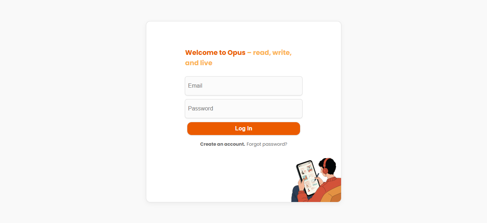
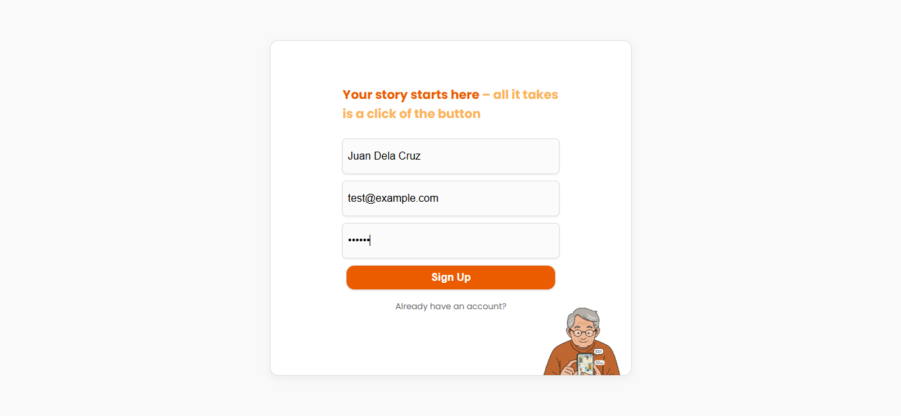
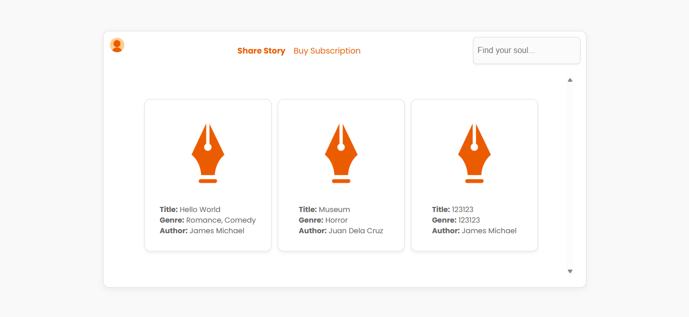
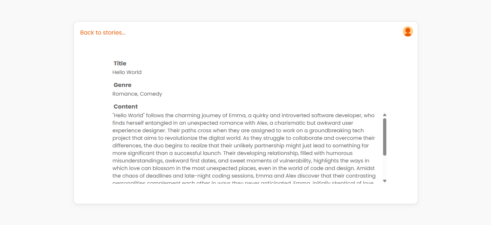
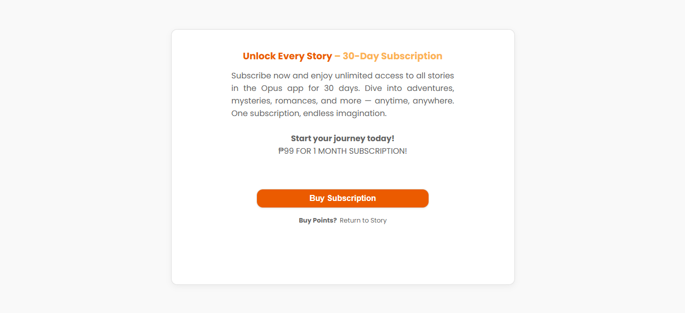
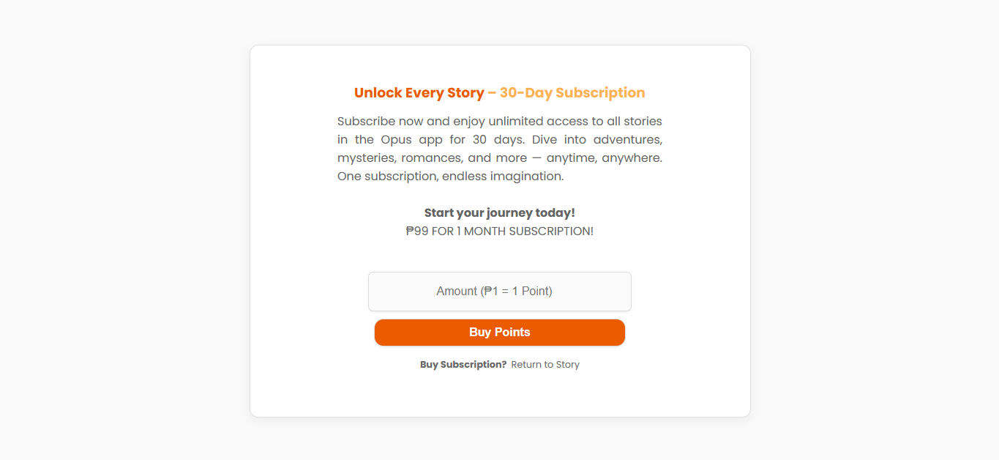
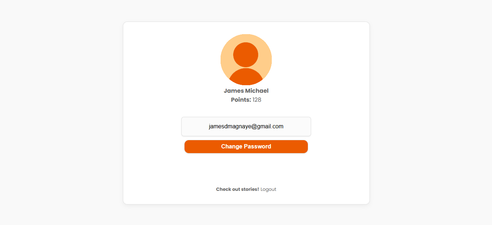

# OPUS - read, write, and live

Opus is inspired by the Latin word for "work" or "creation," often used to describe a masterpiece or an author’s body of work that defines their style and literary legacy. Opus provides a space where writers can share stories, connect with readers, and build a community. It’s a platform for creative expression, where every story contributes to a growing collection of unique narratives that celebrate storytelling and the legacies of the authors who craft them.

